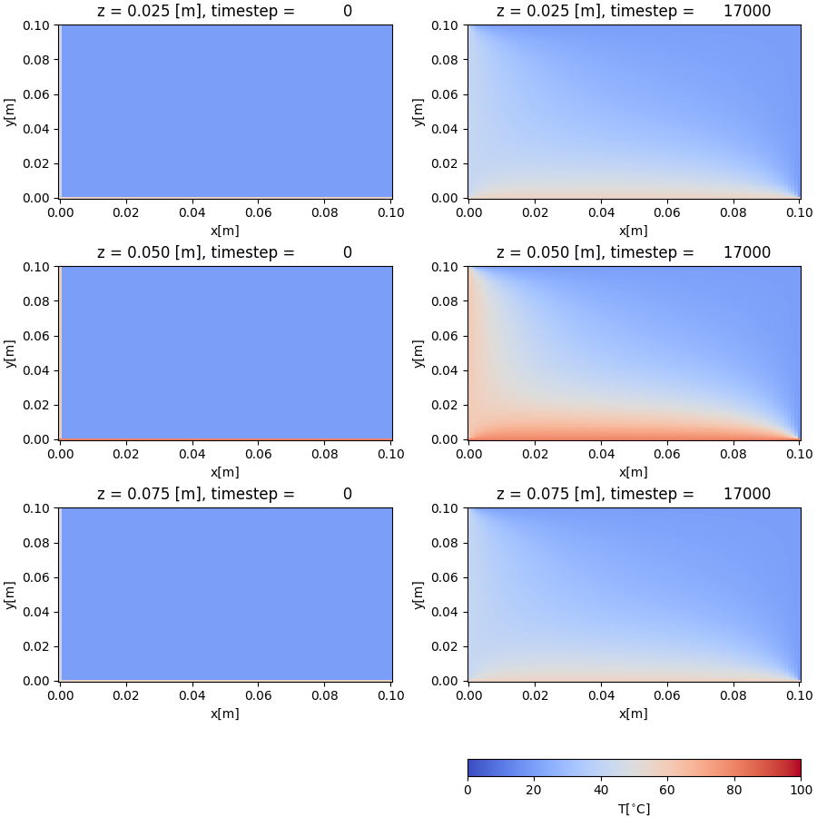

Performs the 3D Thermal Simulation

Issuing at the command line for VH::

    $ mpirun -veo -np 8 python thermal.py -dev vh
    loop_cnt:          0, l2_norm:   560.756531
    loop_cnt:       1000, l2_norm:     3.863911
    loop_cnt:       2000, l2_norm:     1.941148
    loop_cnt:       3000, l2_norm:     1.204764
    loop_cnt:       4000, l2_norm:     0.803408
    loop_cnt:       5000, l2_norm:     0.552903
    loop_cnt:       6000, l2_norm:     0.386492
    loop_cnt:       7000, l2_norm:     0.272347
    loop_cnt:       8000, l2_norm:     0.192709
    loop_cnt:       9000, l2_norm:     0.136654
    loop_cnt:      10000, l2_norm:     0.097005
    loop_cnt:      11000, l2_norm:     0.068903
    loop_cnt:      12000, l2_norm:     0.048968
    loop_cnt:      13000, l2_norm:     0.034811
    loop_cnt:      14000, l2_norm:     0.024766
    loop_cnt:      15000, l2_norm:     0.017631
    loop_cnt:      16000, l2_norm:     0.012578
    loop_cnt:      17000, l2_norm:     0.009005
    elapsed: 12.070626020431519

Issuing at the command line for VE::

    $ VE_NLCPY_NODELIST=0,1,2,3 mpirun -veo -np 4 python thermal.py -dev ve
    loop_cnt:          0, l2_norm:   560.756592
    loop_cnt:       1000, l2_norm:     3.863911
    loop_cnt:       2000, l2_norm:     1.941150
    loop_cnt:       3000, l2_norm:     1.204767
    loop_cnt:       4000, l2_norm:     0.803411
    loop_cnt:       5000, l2_norm:     0.552902
    loop_cnt:       6000, l2_norm:     0.386493
    loop_cnt:       7000, l2_norm:     0.272352
    loop_cnt:       8000, l2_norm:     0.192710
    loop_cnt:       9000, l2_norm:     0.136653
    loop_cnt:      10000, l2_norm:     0.097009
    loop_cnt:      11000, l2_norm:     0.068909
    loop_cnt:      12000, l2_norm:     0.048973
    loop_cnt:      13000, l2_norm:     0.034821
    loop_cnt:      14000, l2_norm:     0.024770
    loop_cnt:      15000, l2_norm:     0.017647
    loop_cnt:      16000, l2_norm:     0.012596
    loop_cnt:      17000, l2_norm:     0.009027
    elapsed: 3.367392063140869

